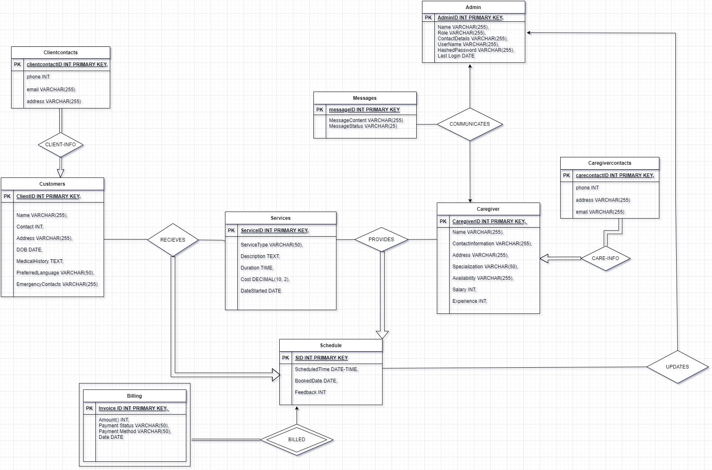

# Home Care Worker Agency Database System

## Overview
I'm thrilled to share the innovative projects I worked on during my second semester of the MSc Data Science program. Here's a closer look at one of the key projects:

### 🏥 Home Care Worker Agency Database System

**Objective:** To develop a comprehensive database system for a Home Care Worker Agency that manages client and caregiver information, schedules services, handles billing, and facilitates communication between clients, caregivers, and administrators.

**Tech Stack:** Python, Django, Vue.js, PostgreSQL, HTML, CSS, JavaScript, Docker

## Project Highlights

### 1. Client Management
- **Data Overview:** The database includes detailed client profiles with attributes such as ClientID, Name, Contact, Address, DOB, Medical History, Preferred Language, and Emergency Contacts.
- **Functionality:** Allows administrators to efficiently manage client information and track their preferences and medical history.

### 2. Caregiver Management
- **Data Overview:** Caregiver profiles contain attributes like CaregiverID, Name, Contact Information, Address, Specializations, Availability, Salary, and Experience.
- **Functionality:** Enables the agency to monitor caregiver schedules, specializations, and availability, ensuring optimal matching with client needs.

### 3. Service Scheduling
- **Schema Details:** The Schedule entity connects clients, caregivers, and services with attributes such as ScheduleID, ClientID (Foreign Key), CaregiverID (Foreign Key), ServiceID (Foreign Key), Amount, ScheduleTime, and Booking Status.
- **Key Achievements:** Streamlined scheduling process, minimizing conflicts and ensuring efficient service delivery.

### 4. Communication
- **Schema Details:** The Communication entity captures interactions between clients and caregivers, with attributes like CommunicationID, ClientID (Foreign Key), CaregiverID (Foreign Key), MessageContent, and MessageStatus.
- **Functionality:** Facilitates effective communication, enhancing service quality and client satisfaction.

### 5. Feedback and Billing
- **Feedback:** Collects and stores client feedback on services and administrators with attributes like FeedbackID, ClientID (Foreign Key), AdminID (Foreign Key), and Feedback.
- **Billing:** Manages invoices and payments with attributes such as InvoiceID, ScheduleID (Foreign Key), Amount, Payment Status, and Payment Method.
- **Key Achievements:** Ensured accurate billing and effective feedback collection, improving transparency and service improvement.

### 6. Administrator Management
- **Schema Details:** Administrator profiles include AdminID, Name, Role, Contact Details, UserName, HashedPassword, and Last_Login.
- **Functionality:** Secures the system with role-based access and tracks administrative actions for accountability.

### 7. Security and Performance
- **Security Measures:** Implemented robust security protocols to protect sensitive data, including hashed passwords and secure communication channels.
- **Performance Optimization:** Utilized indexing and query optimization techniques to ensure efficient data retrieval and system responsiveness.

## Key Contributions

- **Database Design:** Developed a normalized database schema to eliminate redundancies and anomalies, ensuring data integrity and consistency.
- **Backend Development:** Implemented the backend using Django, providing a robust and scalable framework for handling complex business logic and data management.
- **Frontend Development:** Designed a user-friendly interface using Vue.js, enhancing user experience and interaction.
- **Deployment:** Deployed the system using Docker for consistent and scalable deployment across different environments.
- **Novelty:** Introduced an innovative scheduling algorithm that optimally matches caregivers to clients based on multiple factors such as availability, specialization, and client preferences, enhancing service quality and client satisfaction.

## 📋 Software Requirements Specification (SRS)

### 1. Introduction
**Purpose:** The purpose of this SRS document is to provide a detailed description of the Home Care Worker Agency Database System, including its functionalities, requirements, and constraints.

**Scope:** This system is designed to manage client and caregiver information, schedule services, handle billing, and facilitate communication between clients, caregivers, and administrators.

### 2. System Overview
The Home Care Worker Agency Database System will be a web-based application that provides an intuitive interface for administrators to manage all aspects of home care services.

### 3. Functional Requirements
- **Client Management:** Create, read, update, and delete client profiles.
- **Caregiver Management:** Manage caregiver profiles, including their specializations and availability.
- **Service Scheduling:** Schedule services and manage conflicts.
- **Communication:** Enable messaging between clients and caregivers.
- **Feedback Collection:** Collect and store client feedback.
- **Billing:** Generate invoices and handle payments.
- **Administrator Management:** Secure the system with role-based access and track administrative actions.

### 4. Non-Functional Requirements
- **Performance:** The system should handle concurrent users efficiently.
- **Security:** Implement secure authentication and data protection measures.
- **Usability:** The interface should be user-friendly and accessible.
- **Scalability:** The system should be scalable to accommodate a growing number of users and data.

### 5. Use Case Diagrams

### 6. User Interface
- **Admin Dashboard:** A comprehensive dashboard for administrators to manage all aspects of the system.
- **Client and Caregiver Profiles:** Detailed profile pages for clients and caregivers.
- **Service Scheduling Interface:** A calendar view for scheduling services.
- **Communication Module:** A messaging interface for clients and caregivers.

### 7. System Architecture
- **Backend:** Developed using Django, responsible for business logic and database management.
- **Frontend:** Developed using Vue.js, providing a responsive and user-friendly interface.
- **Database:** PostgreSQL, ensuring data integrity and efficient data management.
- **Deployment:** Docker, ensuring consistent and scalable deployment across different environments.

### 8. Testing and Validation
- **Unit Testing:** Testing individual components for correctness.
- **Integration Testing:** Ensuring that all components work together seamlessly.
- **User Acceptance Testing:** Validating the system with end-users to ensure it meets their requirements.

---

This project not only provided a comprehensive solution for managing home care services but also demonstrated advanced database management, web development, and deployment skills. Through this project, I have gained significant experience in SRS documentation, database design, backend and frontend development, and deployment using Docker.